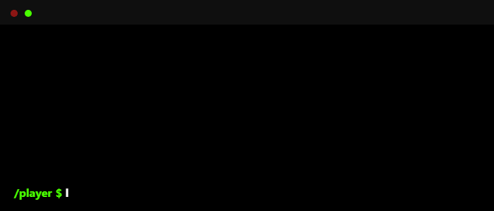

<p align="center">
    
</p>


<h3 align="center">Leveling up one line of code at a time. Passionate about building interactive, fun, and impactful experiences!</h3>


<br>

> ```yaml
> Name: Ken Aeron
> Class: Game Developer
> Location: Philippines
> Level: Beginner
> XP: Unity, C#, Lua
> Guild: PUP Sto Tomas Campus
> ```

<div align="center">
<br>
<h3> <strong>Skills & Tools</strong></h3>
<br>
</div>

<!-- Skills -->
<p align="center">
  <!-- Unity Logo -->
  

  <!-- C# -->
  

  <!-- Java -->
  

  <!-- C++ -->
  

  <!-- JavaScript -->
  

  <!-- HTML5 -->
  

  <!-- CSS3 -->
  

  <!-- PHP -->
  

  <!-- Python -->
  
</p>


<div align="center">
  <h3>Player Stats</h3>
  <kbd>
     <div align="center">
         <p>
       <br>
       <br>
          <!-- Socials -->
         <a href="mailto:ken.aeron.milorin@gmail.com">
            
          </a>
           <a href="https://karmken.github.io">
            
          </a>
          <a href="https://www.facebook.com/mama.momo1234567890">
            
          </a>
         </p>
        <br>
     </div>
   </kbd>
  <kbd>
     <div align="center">
         <p>
       <br> 
         <strong>Profile Views</strong>
       <br>
       <br>
           
         </p>
     </div>
   </kbd>
   <kbd>
     <div align="center">
         <p>
       <br>
       <br>
       <br>
          
       <br>
       <br>
         </p>
     </div>
  </kbd>
</div>
<div align="center">
<br>

</div>


<div align="center">
  
  
</div>

###

<picture>
  <source media="(prefers-color-scheme: dark)" srcset="https://raw.githubusercontent.com/karmken/karmken/output/pacman-contribution-graph-dark.svg">
  <source media="(prefers-color-scheme: light)" srcset="https://raw.githubusercontent.com/karmken/karmken/output/pacman-contribution-graph.svg">
  
</picture>

###


<br>
<div align="center">
<strong>“Games give us the power to escape reality — I want to be the one building the portals.”</strong>
</div>
